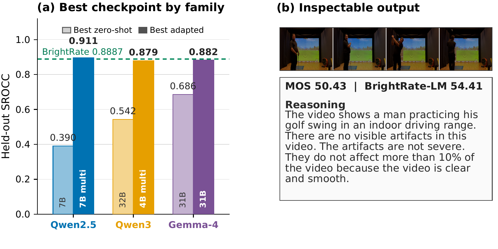
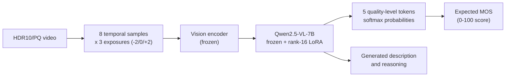

<div align="center">

# BrightRate-LM

**Representation-Aware Reasoning Quality Assessment for User-Generated HDR Video**

[Shreshth Saini](https://shreshthsaini.github.io/), Yilin Wang, Neil Birkbeck, Balu Adsumilli, Alan C. Bovik

[](https://shreshthsaini.github.io/BrightRate-LM/)
[-8b0000)](https://link.springer.com/journal/138)
[-4b44ce)](https://openaccess.thecvf.com/content/WACV2026/papers/Saini_BrightRate_Quality_Assessment_for_User-Generated_HDR_Videos_WACV_2026_paper.pdf)
[](https://huggingface.co/shreshthsaini)
[](https://github.com/shreshthsaini/BrightVQ)
[](LICENSE)



</div>

BrightRate-LM assesses the perceptual quality of user-generated HDR video from a multi-exposure frame stack. It returns a 0 to 100 score, a short description of visible defects, and reasoning for the score. This work extends [BrightRate (WACV 2026, Oral)](https://openaccess.thecvf.com/content/WACV2026/papers/Saini_BrightRate_Quality_Assessment_for_User-Generated_HDR_Videos_WACV_2026_paper.pdf) with a multimodal language model and a controlled study of HDR input representations across three model families (Qwen2.5-VL, Qwen3-VL, Gemma-4) and checkpoints from 2B to 31B.

Related work: [BrightVQ dataset](https://github.com/shreshthsaini/BrightVQ) · [CHUG](https://shreshthsaini.github.io/CHUG/) · [Beyond8Bits](https://shreshthsaini.github.io/Beyond8Bits/)

## How it works

Each video is sampled at eight temporal points, and every frame is rendered at &minus;2, 0, and +2 stops with the Hable operator, so crushed shadows and clipped highlights stay visible. The 24 images pass through the frozen Qwen2.5-VL backbone with rank-16 LoRA adapters; the score is a deterministic expectation over five quality-level tokens, and the same adapted model generates the reasoning separately, so the text never alters the number.



## Results

BrightRate-LM numbers are means across five content-separated 80/20 splits. The BrightRate row contains the published 100-split medians.

| Model | Input | SROCC | PLCC | KRCC | RMSE |
|---|---|---:|---:|---:|---:|
| **BrightRate-LM, Qwen2.5-VL-7B** | Multi-exposure | **0.9052** | **0.9107** | **0.7281** | **5.5348** |
| BrightRate, published | HDR-aware features | 0.8887 | 0.8970 | 0.7059 | 5.7514 |

Zero-shot transfer to the 8,281-clip Beyond8Bits official test set reaches **0.8958 SROCC** without any retraining.

## Findings

- **Adaptation, not scale.** Every completed checkpoint improves after the same lightweight recipe, but zero-shot rank does not predict adapted rank, and more parameters do not guarantee a better HDR quality model.
- **Input representation can outweigh model size.** Multi-exposure input improves every tested Qwen checkpoint over a single Hable tone-mapped view; a 3B model with multi-exposure input (0.8875) overtakes an 8B model with tone-mapped input (0.8586).
- **Only Gemma-4-12B is encoder-free.** It uses `Gemma4UnifiedVisionConfig` and sends pixels through a single learned projection, while the E2B/E4B checkpoints use 16-layer and the 26B/31B checkpoints use 27-layer vision transformers. It is the family outlier in every comparison.
- **Native PQ works once the interface is right.** Two historical native-PQ failures were implementation artifacts. After clip-level statistics matching of PQ values, the encoder-free 12B reaches 0.8383 SROCC, above its Hable tone-mapped result of 0.7763; a percentile-matched control reaches 0.8305.

## Quickstart

Weights are hosted on the Hugging Face Hub:
[](https://huggingface.co/shreshthsaini/brightrate-lm-7b-multiexposure)
[](https://huggingface.co/shreshthsaini)

The demo needs Python 3.11, ffmpeg, and a CUDA GPU with about 20 GiB of free memory.

```bash
git clone https://github.com/shreshthsaini/BrightRate-LM.git
cd BrightRate-LM
uv venv --python 3.11
uv pip install --python .venv/bin/python --index-strategy unsafe-best-match -r requirements.txt

# download the primary adapter from Hugging Face
.venv/bin/hf download shreshthsaini/brightrate-lm-7b-multiexposure \
  adapter_config.json adapter_model.safetensors \
  --local-dir adapters/brightrate-lm-7b

# score a video
.venv/bin/python src/predict.py \
  --video x.mp4 \
  --adapter adapters/brightrate-lm-7b
```

The final command renders eight temporal samples at -2, 0, and +2 stops, then prints JSON with `score`, `level`, `description`, and `reasoning`.

## Training

Download `BrightVQ.csv` from the [BrightVQ repository](https://github.com/shreshthsaini/BrightVQ), place the BrightVQ videos under `data/videos/`, and render the cache:

```bash
.venv/bin/python src/build_expstack_cache.py \
  --videos-dir data/videos \
  --output-dir cache/frames8-expstack \
  --workers 8
```

Run one final split with the paper recipe:

```bash
.venv/bin/python src/train_v2.py \
  --mode final \
  --split 0 \
  --run-name brightrate-lm-split0 \
  --model Qwen/Qwen2.5-VL-7B-Instruct \
  --csv data/BrightVQ.csv \
  --splits configs/splits.json \
  --frames-root cache/frames8-expstack \
  --epochs 2 \
  --schedule-epochs 3 \
  --seed 700 \
  --eval-every-updates 50
```

All default paths and recipe values are in `configs/default.yaml`. Any path can also be given on the command line.

## Roadmap

- [x] Release the multi-exposure and tone-mapped 7B adapters with per-split weights
- [x] Release all 16 study adapters (Qwen2.5-VL, Qwen3-VL, Gemma-4 families)
- [x] Multi-exposure cache builder and single-video scoring script
- [x] Training recipe and content-separated splits
- [x] Zero-shot cross-dataset evaluation on Beyond8Bits and CHUG
- [ ] arXiv preprint of the journal manuscript
- [ ] Hugging Face Space demo for in-browser scoring
- [ ] Complete the remaining native-PQ control runs (plain corrected rescale, SDR patch-training control)
- [ ] Batched folder-level scoring utility

## Citation

```bibtex
@article{saini2026brightratelm,
  title   = {BrightRate-LM: Representation-Aware Reasoning Quality Assessment for User-Generated HDR Video},
  author  = {Saini, Shreshth and Wang, Yilin and Birkbeck, Neil and Adsumilli, Balu and Bovik, Alan C.},
  journal = {Machine Vision and Applications},
  year    = {2026},
  note    = {Submitted}
}

@inproceedings{saini2026brightrate,
  title     = {BrightRate: Quality Assessment for User-Generated HDR Videos},
  author    = {Saini, Shreshth and Chen, Bowen and Wang, Yilin and Birkbeck, Neil and Adsumilli, Balu and Bovik, Alan C.},
  booktitle = {Proceedings of the IEEE/CVF Winter Conference on Applications of Computer Vision},
  pages     = {1522--1532},
  year      = {2026}
}

@inproceedings{saini2025chug,
  title     = {CHUG: Crowdsourced User-Generated HDR Video Quality Dataset},
  author    = {Saini, Shreshth and Bovik, Alan C. and Birkbeck, Neil and Wang, Yilin and Adsumilli, Balu},
  booktitle = {IEEE International Conference on Image Processing},
  pages     = {2504--2509},
  year      = {2025},
  doi       = {10.1109/ICIP55913.2025.11084488}
}

@inproceedings{saini2026beyond8bits,
  title     = {Seeing Beyond 8bits: Subjective and Objective Quality Assessment of HDR-UGC Videos},
  author    = {Saini, Shreshth and Chen, Bowen and Wang, Yilin and Birkbeck, Neil and Adsumilli, Balu and Bovik, Alan C.},
  booktitle = {Proceedings of the IEEE/CVF Conference on Computer Vision and Pattern Recognition},
  pages     = {15538--15549},
  year      = {2026}
}
```

## Acknowledgments

Built on [Qwen2.5-VL](https://github.com/QwenLM/Qwen2.5-VL) with [PEFT](https://github.com/huggingface/peft) LoRA adapters. The study also evaluates [Qwen3-VL](https://github.com/QwenLM/Qwen3-VL) and [Gemma-4](https://ai.google.dev/gemma) checkpoints. Supported by the NSF AI Institute for Foundations of Machine Learning (IFML), the Texas Advanced Computing Center (TACC), and a research collaboration with Google.

The code is released under the MIT License. BrightVQ data remains under its original terms.
